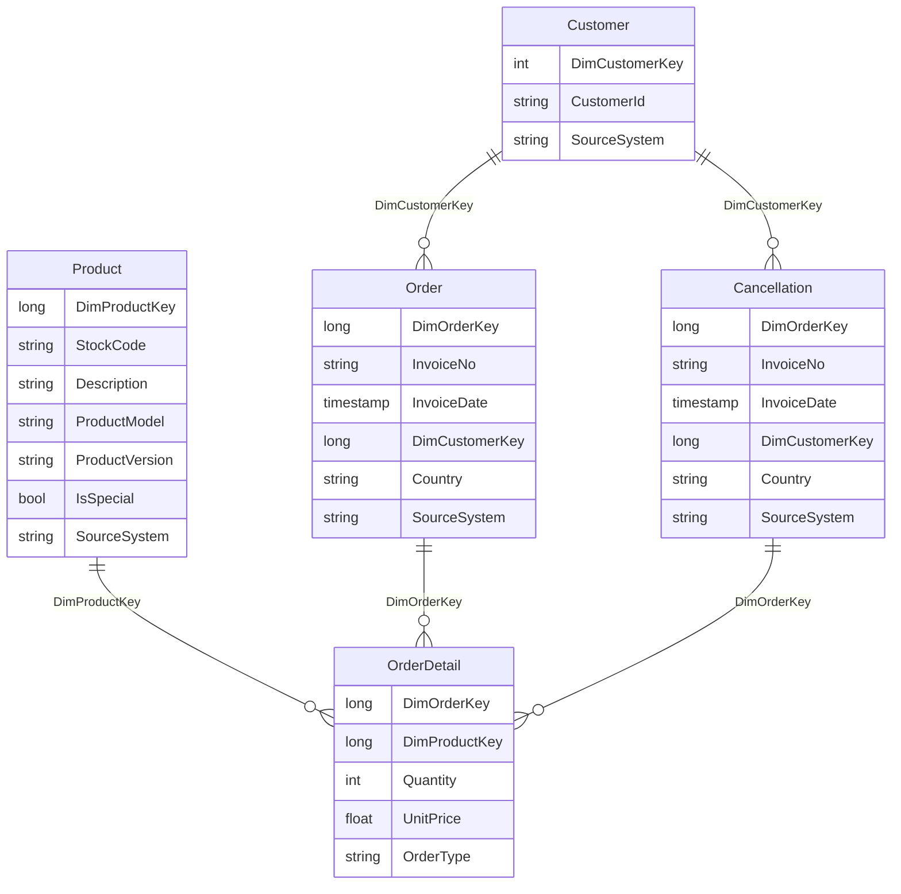

# Generic considerations
Filter out products with 0 unit price

## Warehouse diagram
```markdown


# Dim Product
Table containing all information about the products
## Columns
- DimProductKey | LONG
- StockCode | STR
- Description | STR
- ProductModel | STR
- ProductVersion | STR
- IsSpecial | BOOL
- SourceSystem | STR
## Business Keys
Hash32 based on:
- "Product"
- StockCode

# Dim Customer
Table containing information about customers
## Columns
- DimCustomerKey | LONG
- CustomerId | STR
- SourceSystem | STR
## Business Keys
Hash32 based on:
- "Customer"
- CustomerId
## Transforms
Empty CustomerId is replaced by "Unknown"

# Dim Order
Table containing generic informations about orders
## Columns
- DimOrderKey | LONG
- InvoiceNo | STR
- InvoiceDate | TIMESTAMP
- DimCustomerKey | LONG
- Country | STR
- SourceSystem | STR
## Business Keys
Hash32 based on:
- "Order"
- InvoiceNo
- SourceSystem

foreign key - DimCustomerKey -> Customer.DimCustomerKey
## Transforms
Filter out cancellations which are kept in different table

# Dim Cancellation
Table containing generic informations about cancellations
## Columns
- DimOrderKey | LONG
- InvoiceNo | STR
- InvoiceDate | TIMESTAMP
- DimCustomerKey | LONG
- Country | STR
- SourceSystem | STR
## Business Keys
Hash32 based on:
- "Cancellation"
- InvoiceNo
- SourceSystem

foreign key - DimCustomerKey -> Customer.DimCustomerKey
## Transforms
Filtered out cancellations

# Dim OrderDetail
Table containing list of products for each order or cancellation
## Columns
- DimOrderKey | LONG
- DimProductKey | LONG
- Quantity | INT
- UnitPrice | FLOAT
- OrderType | STR
## Business Keys
foreign key - DimOrderKey -> Order.DimOrderKey
foreign key - DimProductKey -> Product.DimProductKey
